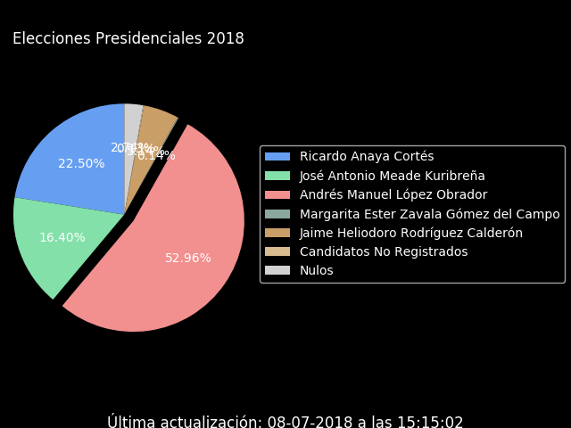

# PREP 2018 - Presidential Elections Bot

This repository contains the Python bot used to synchronize the latest data from the PREP (Preliminary Program of Electoral Results) with a Reddit post. It also contains all the raw data collected.

## What is the PREP?

The PREP is a system that provides the preliminary results of the federal elections, through the capture and publication of the data captured by the polling officials that are received in the Collection Centers and Data Transmission (CEDAT).

It allows to make known, in real time through the Internet, the preliminary results of the elections on the same night of the Electoral Day, with certainty and opportunity and using the most advanced technology.

It is very important to note that the PREP doesn't give definitive results and its purpose is to be informative.

## Making the Bot

The idea behind the bot was to collect data for future analysis and to provide the users of Reddit with a quick way to know the results.

To accomplish this I wrote a Python bot that does the following:

* Acquire the latest results from the PREP website.
* Extract and format the values I required.
* Generate a pie plot, upload it to Imgur and get back the permanent link.
* Submit the results and the plot to Reddit.

The initial idea was to use `Web Scraping` to get the data from the PREP website. Fortunately the website offered a [JSON](./sample.json) file containing all the data required.

THe following is an example structure of a candidate:

```json
{
    "idPartido": 20,
    "nombrePartido": "COALICIÓN POR MÉXICO AL FRENTE (PAN-PRD-MC)",
    "siglasPartido": "PAN-PRD-MC",
    "emblemaPartido": "pan_prd_mc.png",
    "colorPartido": "669FF1",
    "idCandidatoPropietario": 1,
    "idCandidatoSuplente": 0,
    "nombreCandidatoPropietario": "Ricardo Anaya Cortés",
    "fotoCandidatoPropietario": "FOTO_1.jpg",
    "nombreCandidatoSuplente": "",
    "idSubcoaliciones": [
        21,
        22,
        23,
        1,
        3,
        6
    ],
    "idsSubMosaico": [
        1,
        3,
        6
    ],
    "total": 2190,
    "porcentaje": 28.8994,
    "totalVN": 2190,
    "totalVE": 0
}
```

Getting the name, votes, percentage and colors was straightforward and was already compatible with the template I have designed.

After getting those values from all the candidates, I formatted them into a Markdown table. To make it easier to read I applied a bold style to the candidate that was currently ahead on votes.

Then I created a pie plot with `Matplotlib` using the candidates names, percentages and colors, uploaded it to Imgur and got back the permanent link.

Finally, I combined the Markdown results with the image link and posted the changes to Reddit using `PRAW`.

This bot was run on a VPS during one week on 15 minutes intervals. I used the following crontab instruction:

`15,30,45,0 * * * * cd /home/bot && python3 main.py`

## Final Results and Thoughts

The latest results (as of this writting) from the PREP were:

Candidate | Votes | Percentage
--|--|--
Ricardo Anaya Cortés | 10,249,705 | 22.4982%
José Antonio Meade Kuribreña | 7,472,431 | 16.402%
**Andrés Manuel López Obrador** | **24,127,451** | **52.96%**
Margarita Ester Zavala Gómez del Campo | 64,643 | 0.1418%
Jaime Heliodoro Rodríguez Calderón | 2,339,431 | 5.135%
Non-Registered Candidates | 57,561 | 0.1263%
Null Votes | 1,246,568 | 2.7362%

Votes Total: 45,557,790 | Compiled Records : 93.5628%



Developing this bot was a fun and rewarding experience and I know there's plenty of room for improvement, especially with the figure design.

I'm eager to give this another shot for the next elections. Now that I know what data to expect I can get more creative and provide further insights.

If you need help or have a question about this project feel free to open an issue.
